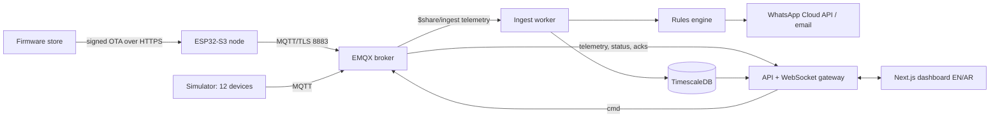

# Architecture

```mermaid
flowchart LR
  node[ESP32-S3 node] -- MQTT/TLS 8883 --> emqx[EMQX broker]
  sim[Simulator: 12 devices] -- MQTT --> emqx
  emqx -- $share/ingest telemetry --> ingest[Ingest worker]
  ingest --> db[(TimescaleDB)]
  ingest --> rules[Rules engine]
  rules --> notify[WhatsApp Cloud API / email]
  emqx -- telemetry, status, acks --> api[API + WebSocket gateway]
  api -- cmd --> emqx
  api <--> web[Next.js dashboard EN/AR]
  db --> api
  store[Firmware store] -- signed OTA over HTTPS --> node
```

The details are filled in as the phases land. See the ADRs in `docs/adr/`.
